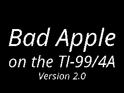
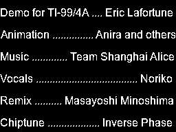
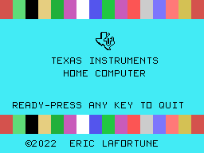

# Bad Apple

[Bad Apple](https://en.wikipedia.org/wiki/Bad_Apple!!) is a popular Japanese
shadow-art [animation video](https://www.youtube.com/watch?v=G3C-VevI36s) that
runs as a demo on many computer platforms. This is another version for the
TI-99/4A home computer.

## Screenshots

You can watch the full [video](https://youtu.be/vx__aAdm4wQ) on Youtube.

## Features

* Data: 4.5 MB in cartridge ROM.
* Player code: 394 bytes of assembly (TMS990 processor).
* Animation: 256x192 pixels at 25 fps or 30 fps (TMS9918 video processor).
* Sound: chiptune at 50 fps or 60 fps (TMS9919/SN76489 sound processor).
* Vocals: linear predictive coding at 40 fps (TMS5200 speech synthesizer).

## Requirements

* TI-99/4A home computer.
* A programmable cartridge with at least 4.5 MB of ROM/RAM.

or:

* An emulator for the TI-99/4A, such as Mame.

## Downloading

You can download the [latest
binary](https://github.com/EricLafortune/BadApple/releases/latest) from
Github.

## Building

If you want to build the demo yourself, you'll need a couple of tools. These
are readily available for Linux distributions, but other platforms should work
as well.

* A Java runtime environment, version 14 or higher, for the video tools.
* The _ImageMagick_ image toolkit (Debian package `imagemagick`), for creating
  the titles.
* The `ffmpeg` video converter (Debian package `ffmpeg`), for extracting
  the video frames.
* The `sox` sound tool (Debian package `sox`), for converting the speech audio
  files.
* My [video tools](https://github.com/EricLafortune/VideoTools/) for the
  TI-99/4A, for computing the speech coefficients and for tying the animation,
  music, and vocals together.
* The [xdt99](https://github.com/endlos99/xdt99) cross-development tools, for
  assembling the final video player.

You'll need to download the data files manually:

* The [video](https://www.youtube.com/watch?v=G3C-VevI36s) as
  `data/BadApple.webm`.
* The
  [music](https://github.com/bitshifters/bad-apple/blob/master/data/music.vgm?raw=true)
  as `data/BadAppleMusic.vgm`.
* The
  [vocals](https://mega.nz/file/POpWDYCB#7mFaV6jeYKtcEG_rfZVc4UG7bv0rYwQpbWE4viNJdYg)
  as `data/BadAppleVocals.wav`.

On Linux, you can then run the build script.
Building for a European 50Hz PAL system (the default):

    ./build.sh pal

or building for a US 60Hz NTSC system:

    ./build.sh ntsc

Alternatively, you can run its commands manually.

You'll then have
* a raw cartridge ROM file `out/romc.bin`.
* a cartridge file `out/BadApple.rpk` that is suitable for emulators like
  Mame.

## Running

The easiest way is to use the Mame emulator (version 0.243 or higher).

On Linux, you can run the script to launch Mame with the proper options.
Emulating a European 50Hz PAL system (the default):

    ./run.sh pal

or emulating a US 60Hz NTSC system:

    ./run.sh ntsc

Alternatively, you can run the Mame command manually.

Once Mame is running and showing the TI-99/4A home screen:

1. Press any key.
2. Press `2` for "BAD APPLE" or `3` for "BAD APPLE WITH VOCALS".

You can exit Mame by pressing `Insert` and then `Esc`.

## Implementation

I have created an optimized video format and a video player that essentially
send streams of bytes to the video processor (TMS9918), the sound processor
(TMS9919/SN76489), and the speech synthesizer (TMS5200). The project grew to
the point that the [video tools](https://github.com/EricLafortune/VideoTools)
are now a separate project. The tools are more generally useful for creating
and playing videos on the TI-99/4A.

The *animation* of Bad Apple has been sampled down to 256x192 monochrome
pixels at 25 Hz. The video tools compress them losslessly. The player runs in
bitmap mode. It updates the necessary characters in the screen image table of
32x24 characters and their corresponding patterns of 8x8 pixels each, in the
pattern definition table. Since the video is monochrome (except for the
postcredits), it doesn't need to update the color definition table, which
keeps the frame rate sufficiently high.

The *music* was available as a chiptune at 50 fps, in VGM format. The video
tools convert and simplify those data to streams of data for the sound
processor.

The *vocals* were available as a sound file. I've converted them to linear
predictive coding (LPC) speech coefficients at 40 fps, using the
my own ConvertWavToLpcd tool from the video tools. It computes and quantizes
the coefficients specifically for the speech synthesizer. The sound file has
a lot of echo/reverb/overdub, which makes it particularly hard to analyze and
convert. After a lot of tweaking, the current final result is fair.

## Other versions

The animation is a hallmark test for retrocomputing. These are many versions
for platforms from the 1980s.

| Computer      | Developer                                                                                        | Video                                   | Processor       | Video processor | Sound processor   | Video performance      | Sound performance |
|---------------|--------------------------------------------------------------------------------------------------|-----------------------------------------|-----------------|-----------------|-------------------|------------------------|-------------------|
| TI-99/4A      | [Tursi](https://atariage.com/forums/topic/331551-bad-apple-demo/?do=findComment&comment=5009503) | [video](https://youtu.be/ZXyFuyKTAb4)   | TMS9900 @ 3 MHz | TMS9918         | TMS9919           | 192x128 pixels @ 16 fps| PCM @ 13.8 kHz    |
| TI-99/4A      | [Asmusr](https://atariage.com/forums/topic/338296-bad-apple-on-cartridge/?do=findComment&comment=5096661) |                                | TMS9900 @ 3 MHz | TMS9918         | TMS9919           | VQ @ 15 fps            | /                 |
| TI-99/4A      | Eric Lafortune                                                                                   |                                         | TMS9900 @ 3 MHz | TMS9918         | TMS9919 + TMS5200 | 256x192 pixels @ 25 fps| Chiptune + vocals |
| ZX Spectrum   | ?                                                                                                | [video](https://youtu.be/cd5iEeIe7L0)   | Z80 @ 3.5 MHZ   | ULA             | 2 x AY/YM         | 256×192 pixels         |                   |
| C64           | [Algorithm](https://csdb.dk/scener/?id=10879) / [Onslaught](https://onslaught.c64.org/welcome)   | [video](https://youtu.be/fu7rRYkWsyk)   | 6510 @ 1 MHz    | VIC-II          | SID 6581          | VQ @ 12 fps            | Chiptune          |
| MSX1          | [Pyhesti](https://www.pouet.net/user.php?who=104737)                                             | [video](https://homebrew.file-hunter.com/index.php?id=badapple) | Z80 @ 3.5 MHz  | TMS9918 | AY-3-8910 | VQ              | Chiptune          |
| MSX TurboR    | [Ryun](http://ryun.halfmoon.jp/msx/badapple/)                                                    | [video](https://youtu.be/fdkBV9GjX30)   | Z80 @ 3.5 MHz   | TMS9958         | AY-3-8910         | 256x192 pixels @ 30 fps| PCM @ 15.75 kHz   |
| MSX TurboR    | [Yeongman Seo](http://sharksym.egloos.com/)                                                      | [video](https://youtu.be/5920MuU9DQg)   | Z80 @ 3.5 MHz   | TMS9958         | AY-3-8910         | 256x192 pixels @ 12 fps| PCM @ 11 kHz      |
| BBC Micro     | [Bitshifters](https://bitshifters.github.io/posts/prods/bs-badapple.html)                        | [video](https://youtu.be/8R4TiPSc7y0)   | 6502 @ 2MHz     | SAA5050         | SN76489           | 40x25 chars @ 25 fps   | Chiptune @ 50 fps |
| Intellivision | [Decle](https://atariage.com/forums/topic/266031-intellivision-bad-apple/)                       | [video](https://youtu.be/tyknZvRQCaU)   | CP1610 @ 895 kHz| AY-3-8900-1     | AY-3-8914         | 80x48 pixels @ 30 fps  |                   |
| Sega Master System | [Psidum et al.](https://www.smspower.org/Homebrew/BadAppleForSMS-SMS)                       | [video](https://youtu.be/8IrxK_nT1o8)   | Z80 @ 3.59 MHz  | YM2602          | SN76489           | 256x192 pixels @ 25 fps|                   |
| Sega Megadrive| ?                                                                                                | [video](https://youtu.be/2vPe452cegU)   | 68000 @ 7.6 MHz | YM7101          | YM2612            | 320x224 pixels @ 30 fps| ADPCM @ 13 kHz    |
| NEC PC-6601   | タイニーP                                                                                        | [video](https://www.nicovideo.jp/watch/sm9280746) | Z80 @ 4 MHz | ìPD8049 | AY-3-8910 + µPD7752 | 256x192 pixels @ 9 fps | Chiptune + vocals |

The demos all have different strengths. Versions with PCM audio render the
original music and audio. Also notably, the BBC Micro version and the C64
version run off floppy disks!

## Acknowledgements

[Team Shanghai Alice](https://en.wikipedia.org/wiki/Team_Shanghai_Alice)
developed the orginal video game Touhou. Masayoshi Minoshima and
[Nomico](https://en.wikipedia.org/wiki/Nomico) created a remix of the music. A
collaborative group led by Anira created the video.

[Inverse Phase](https://www.inversephase.com/) composed the chiptune,
originally for the [demo on the BBC Micro
version](https://bitshifters.github.io/posts/prods/bs-badapple.html).

_Secondary German_ extracted an acapella version of the song
([video](https://youtu.be/eViJlhkKU7Q),
[audio](https://mega.nz/file/POpWDYCB#7mFaV6jeYKtcEG_rfZVc4UG7bv0rYwQpbWE4viNJdYg)).

## License

This Bad Apple demo for the TI-99/4A is released under the GNU General Public
License, version 2.

Enjoy!

Eric Lafortune
